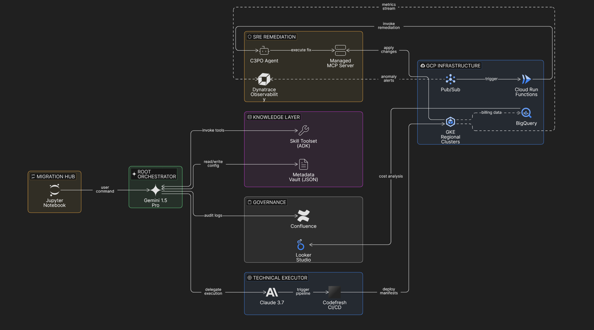

# Implementation Guide: Project Catalyst Architecture

This document explains the "How" behind the architecture seen in `image_2f0255.png`.

## 1. The Validation Layer (The "Wait, is this right?" Step)
*   **Engine:** Gemini 1.5 Pro.
*   **Process:** The agent acts as a pre-deployment auditor. It reads the `Metadata Vault` (JSON) to ensure the proposed migration matches the actual constraints of the **Mumbai** environment before a single line of code is executed.

## 2. Technical Execution (The Manifest Factory)
*   **Handoff:** Once validated, **Claude 3.7** generates the K8s manifests.
*   **Why Claude?** It provides high-fidelity code generation that minimizes deployment errors in **Codefresh**.

## 3. The Reflex Arc (Autonomous SRE)
Instead of manual monitoring, we use a closed-loop system:
1.  **Dynatrace** spots a breach in our SLIs.
2.  **Pub/Sub** alerts a **Cloud Run Function**.
3.  The **C3PO Agent** uses **MCP** to "talk" to the cluster and apply a remediation patch immediately.

## 4. Visibility (The "Paper Trail")
*   **Confluence:** Automated logs for every agent action.
*   **Looker:** A dashboard that pulls from **BigQuery** so the team can see the migration's cost and health at a glance.

  

